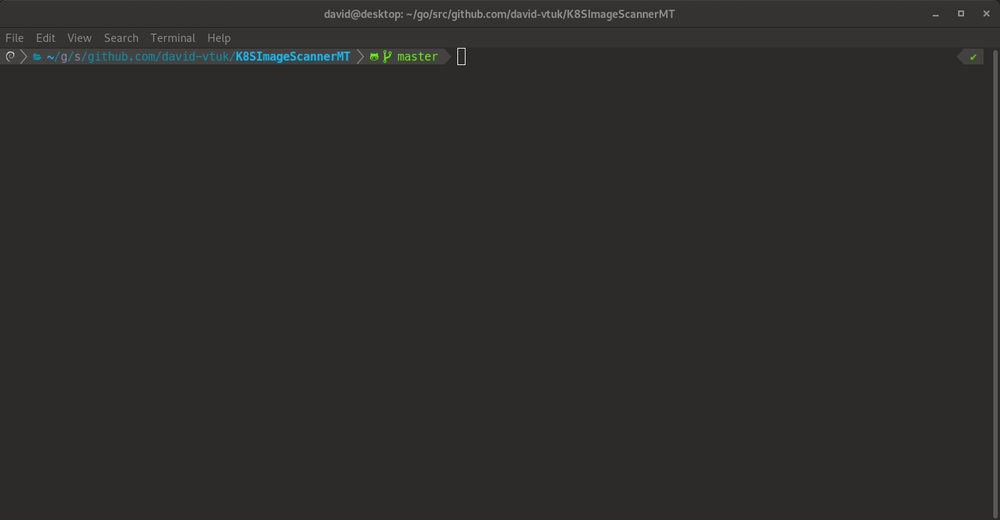

# Multi Threaded K8s Image Scanner

## About

This application reads a kubeconfig file in ~/.kube/config and iterates through all namespaces and pods to determine those which have been created with either:

* `:latest` 
* `default` 

In the corresponding container image tag. It does so leveraging multiple `goroutines` 

